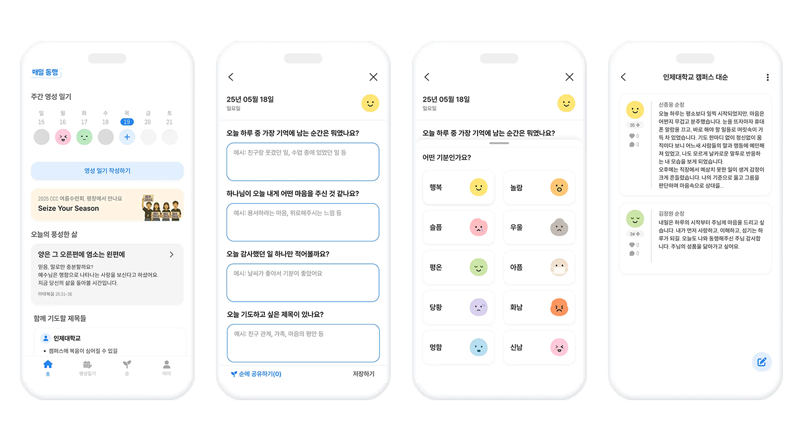

 

  

  <h1 align="center">매일동행</h1>

  

    <strong>함께 쓰는 영성일기, 함께 걷는 믿음의 여정</strong>
     
     
    
     
     
    <strong>React Native • Expo • Supabase • Drizzle ORM</strong>
  

  

    <a href="#주요-기능">주요 기능</a> •
    <a href="#기술-스택">기술 스택</a> •
    <a href="#프로젝트-구조">프로젝트 구조</a> •
    <a href="#시작하기">시작하기</a>
  

 

## About The Project

**매일동행**은 기독교 신앙인들을 위한 **영성 일기 모바일 앱**입니다.

매일의 감정과 묵상을 기록하고, "순"(소그룹)을 통해 신앙 여정을 함께 나눌 수 있습니다.
오프라인에서도 일기를 작성할 수 있으며, 네트워크 연결 시 자동으로 동기화됩니다.

 

### 앱 스크린샷

  

 

##  주요 기능

| 기능 | 설명 |
|------|------|
|  **영성일기 작성** | 자유 글쓰기 또는 질문 기반 글쓰기 모드 지원 |
| **감정 기록** | 다양한 감정 아이콘으로 오늘의 기분 표현 |
| **순 그룹** | 소그룹 생성, 일기 공유, 멤버 관리 |
| **캘린더 뷰** | 주간/월간 일기 열람 |
| **초대 링크** | 딥링크를 통한 순 그룹 초대 |
| **오늘의 풍성한 삶** | 외부 QT(묵상) 콘텐츠 연동 |
| **오프라인 지원** | 네트워크 없이도 일기 작성 가능 |

 

## 기술 스택

### Frontend
- **React Native 0.79** + **Expo SDK 53**
- **TypeScript** - 타입 안전성
- **React Navigation 7** - 네비게이션 (Stack + Bottom Tabs)

### 상태 관리
- **Zustand** - 전역 상태 관리 (인증, 설정)
- **TanStack Query** - 서버/로컬 데이터 캐싱 및 동기화

### 데이터베이스
- **Supabase** - 백엔드 (PostgreSQL, Auth, Storage)
- **Drizzle ORM + SQLite** - 오프라인 지원을 위한 로컬 데이터베이스

### UI/UX
- **@gorhom/bottom-sheet** - 바텀시트 모달
- **react-native-calendars** - 캘린더 UI
- **Pretendard 폰트** - 한글 최적화 폰트

### 인증
- 카카오 로그인
- Google Sign-In
- Apple Sign-In (iOS)

 

 